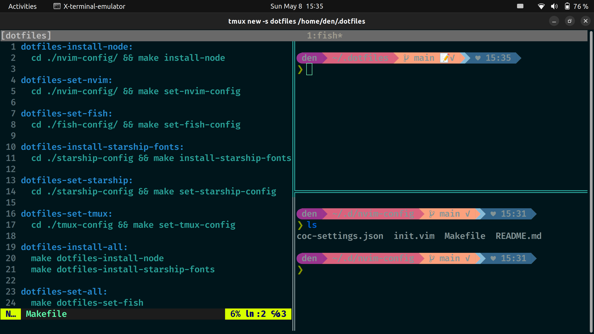

# .dotfiles

### terminal image.



### What to set.

fish, neovim, tmux, starship.

### installation of fish, neovim, tmux, starship.

#### fish

##### packages for ubuntu.

```
sudo apt-add-repository ppa:fish-shell/release-3
sudo apt update
sudo apt install fish
```

#### neovim

##### packages for ubuntu.

```
sudo apt-get install -y software-properties-common
sudo add-apt-repository -y ppa:neovim-ppa/unstable
sudo apt-get update -y
sudo apt-get install -y neovim
```

#### tmux

##### packages for ubuntu.
```
sudo apt install tmux
```

#### starship

##### for Linux.
```
snap install starship
```

### Clone repository containing submodules.

```
git clone --recursive https://github.com/den8383/.dotfiles.git
```

### Do all the setup.

node and fonts is installed.

config file is set.

```
make run-setup
```

### Set only the config file.

If you have run "run-setup" before, it is better to use "dotfiles-set-all".

No installation is done, so it finishes early.

```
make dotfiles-set-all
```
